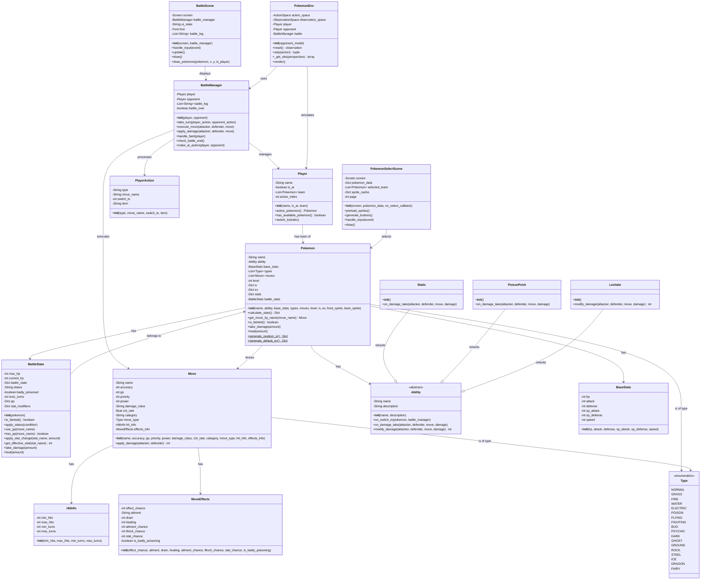

# Pokemon SoulSilver - Class Diagram

## Class Overview

**18 Total Classes** organized into 6 main categories:

### Core Battle System (4 classes)
- `BattleManager` - Orchestrates battles and turn execution
- `Player` - Represents human/AI players with Pokemon teams  
- `Pokemon` - Individual Pokemon with stats, moves, and abilities
- `BattleStats` - Runtime battle statistics and status effects

### Move System (3 classes)
- `Move` - Pokemon moves with damage calculation
- `HitInfo` - Multi-hit move information
- `MoveEffects` - Status effects and secondary effects

### Ability System (4 classes)
- `Ability` - Abstract base class for Pokemon abilities
- `Static` - Paralyzes on physical contact
- `PoisonPoint` - Poisons on physical contact  
- `Levitate` - Immunity to Ground-type moves

### Data Models (3 classes)
- `BaseStats` - Pokemon base statistics
- `Type` - Enumeration of all 18 Pokemon types
- `PlayerAction` - Represents player choices (move/switch/item)

### UI Layer (2 classes)
- `BattleScene` - Main battle interface
- `PokemonSelectScene` - Pokemon team selection

### AI Integration (1 class)
- `PokemonEnv` - OpenAI Gym environment for reinforcement learning

## Key Relationships
- **Composition**: Pokemon contains BattleStats, BaseStats, Ability, and Moves
- **Inheritance**: Ability system uses polymorphism for different ability types
- **Dependency**: BattleManager orchestrates interactions between all core classes